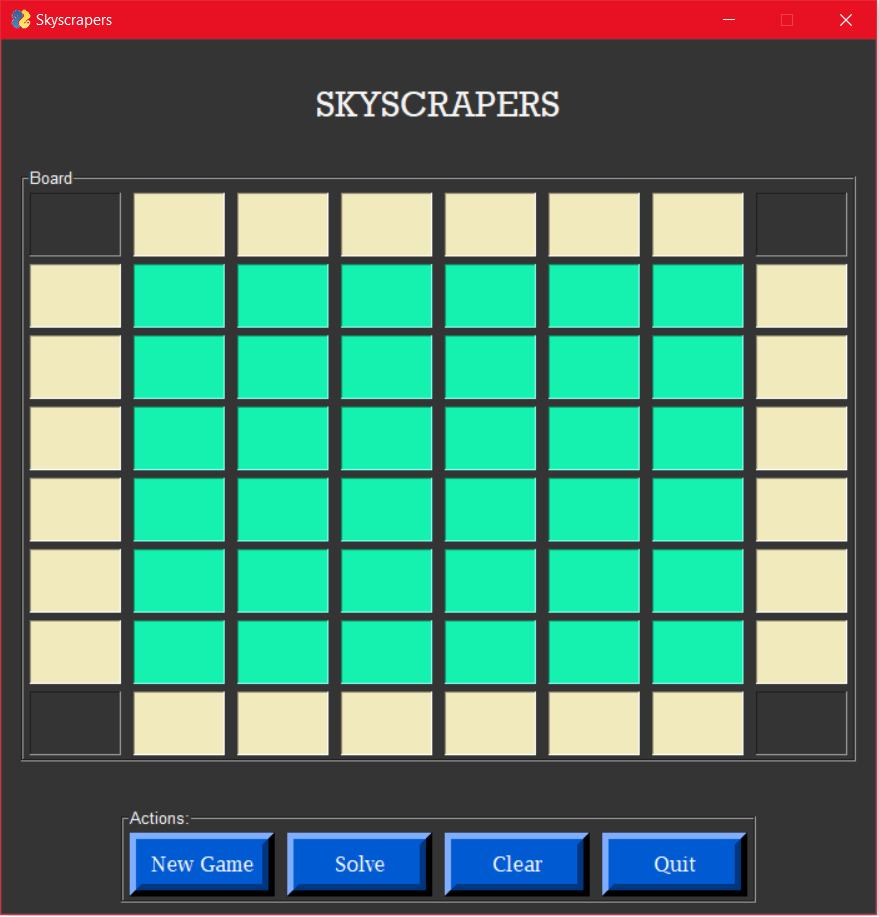
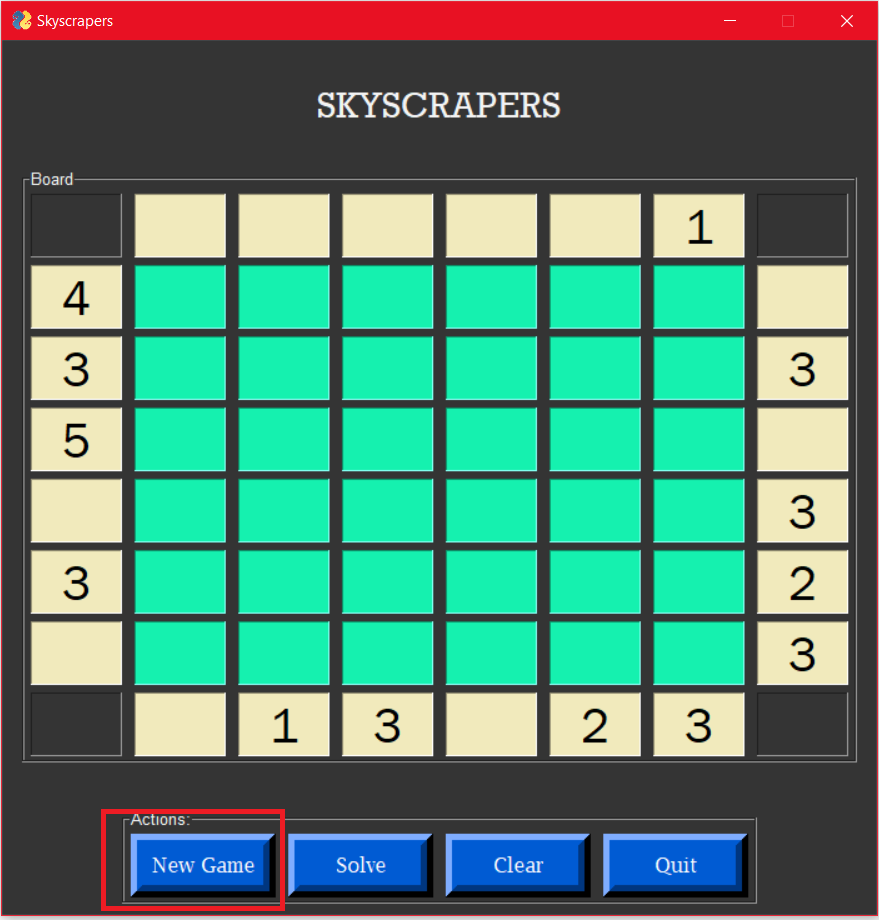
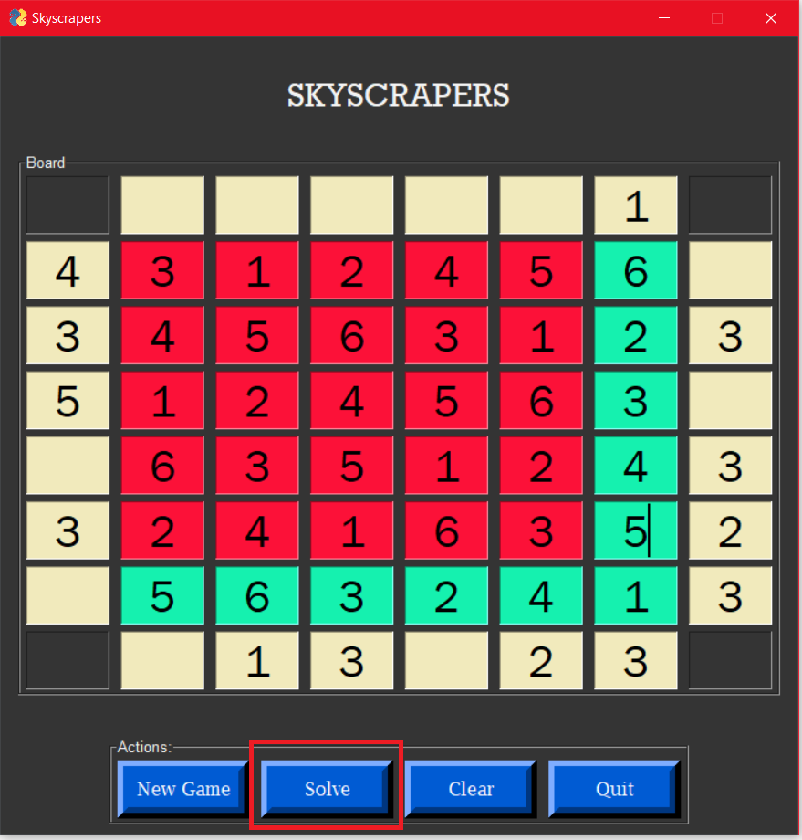

# Skyscraper Puzzle

## Table of contents
* [Introduction](#introduction)
* [Technologies](#technologies)
* [Illustrations](#illustrations)

## Introduction

A simple app powered by PySimpleGUI that generate and solve 6x6 skyscrapers puzzles with unique solution.

Skyscrapers is a building placing puzzle based on an 6x6 grid with some clues along its sides. The object is to place a skyscraper in each square, with a height between 1 and 6, so that no two skyscrapers in a row or column have the same number of floors. In addition, the number of visible skyscrapers, as viewed from the direction of each clue, is equal to the value of the clue. 

## Technologies
Project is created with:
* Python 3.8.9
* PySimpleGUI 4.38.0

## Illustrations

